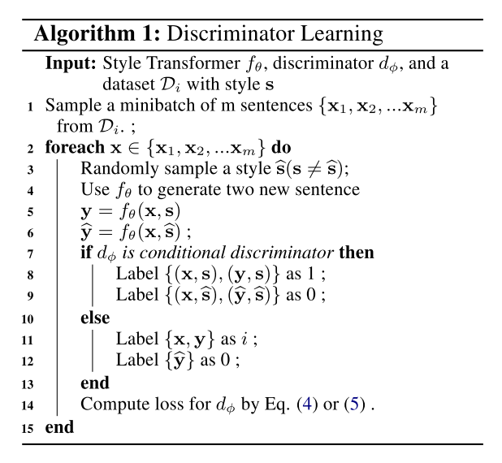
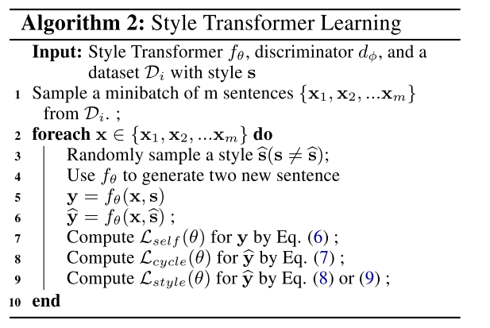
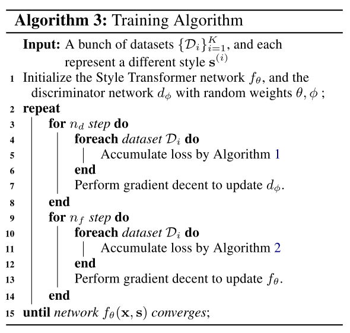
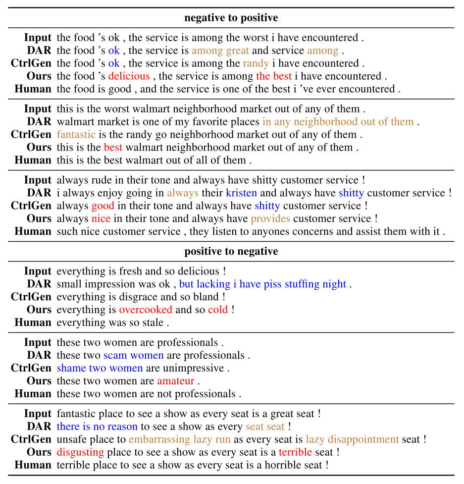

昨天的文章介绍了在输出空间对文本生成进行控制的两篇论文，今天介绍一篇在隐空间控制的论文。

隐空间方法也分为两个流派，一种认为在隐空间里可以把内容和特性的向量表示分开（disentangled)，然后通过修改特性向量来实现对特性的控制；另一种则无须这种假设。下面分别介绍一篇相关论文。

# Style Transfer from Non-Parallel Text by Cross-Alignment 
disentangled representation的代表作之一，发表在2017年的NIPS上，如今引用已经接近300多。

# Style Transformer: Unpaired Text Style Transfer without Disentangled Latent Representation
复旦大学NLP组发表于2019年的文章，已经被引用20次，文章标题中明确写了他们的方法without Disentangled Latent Representation。

在文章的introduction部分列举了一些Disentangled表示的问题，我觉得比较重要的两条是：

- 难以评价Disentangled表示的质量，纯粹的Disentangled表示也很难获得；
- 分离不是必要的，有文章已经论证了靠解码器就可以overwrite风格。

这篇文章总的来说是对抗生成网络的思路。模型分两大块，一块是典型的encoder-decoder结构的transformers，用来作为风格迁移器，另一块是判别器，用来解决由于没有平行语料带来的训练问题。

## 判别器训练
文中提出了两种判别器，从结果上看多分类判别器对BLEU指标更友好，而条件判别器对迁移后的风格更友好。

### 多分类判别器
这种方法比较好理解，即采用K+1类的多类分类器作为判别器，输入只有句子。后K类对应K种风格，第0类对应$f_\theta(\rm{x},\rm{\hat{s}})$，即假样本。在训练时判别器时，将原始语料和用原风格重建后的句子都标为对应的风格，假样本标为第0类。在训练风格转换器的时候，我们希望转换器能尽量提高$f_\theta(\rm{x},\rm{\hat{s}})$被判别为$\rm{\hat{s}}$类的概率，即能骗过判别器，使判别器不认为生成的是个假样本。

### 条件判别器
输入包括句子和风格，判别器需要判断句子是否含有风格（二分类）。训练判别器时将原始语料和重建句子$f_\theta(\rm{x},\rm{s})$标注为正样本，将变换后的句子$f_\theta(\rm{x},\rm{\hat{s}})$标注为负样本。

## 风格迁移器训练
风格迁移器有三个重要的任务，一个是自重建（Self Reconstruction），一个是循环重建（Cycle Reconstruction），以及风格控制（Style Controlling）。

自重建就是输入句子$\rm{x}$以及其原本风格的控制变量$\rm{s}$，让他生成自己。这个任务是可以使用监督学习来完成的，loss计算公式如下

$$
L_{\rm{self}}=-p_\theta(\rm y=\rm x|\rm x,\rm s)
$$

循环重建是先输入$\rm{x}$和一个其他的风格控制变量$\rm{\hat{s}}$，生成$\rm\hat y$，再用$\rm\hat y$和$\rm s$生成一个$\rm y$。此时$\rm y$应该和$\rm{x}$无论内容及风格都一致，并且可以使用监督学习来计算loss：

$$
L_{\rm{cycle}}=-p_\theta(\rm y=\rm x|f_\theta(\rm x,\rm\hat s), \rm s)
$$

前面两个任务虽然解决了没有平行语料带来的训练问题，但思考一下就会发现这两个任务并不会起效果。模型可以完全只学习返回原句子就可以“蒙混过关”。解决的办法就是检验一下循环的中间结果$f_\theta(\rm x,\rm\hat s)$，这个中间结果应该尽可能含有$\rm\hat s$风格。因此引入了第三个风格控制任务，这个任务根据判别器的不同也分成两种情况：

- 采用多分类判别器时的loss

$$
L_{\rm style} = -p_\phi(\rm c=\rm\hat s|f_\theta(\rm x,\rm\hat s))
$$

- 采用条件判别器时的loss
$$
L_{\rm style} = -p_\phi(\rm c=1|f_\theta(\rm x,\rm\hat s),\rm\hat s)
$$

总体的训练框架类似于GANs，如下图所示。

以前看GANs也比较少，第一次读到这篇论文的时候还是挺惊奇的，整个流程和损失函数的设计太巧妙了。正如文中讨论所说，三个Loss都在训练中扮演了重要的角色：

- 自重建任务让模型能够生成通顺的语句；
- 循环重建任务让模型学会保留语句中的“内容”；
- 风格控制任务由判别器则提供了监督信号，让模型学会改变风格。

CV领域对GAN的研究已经比较多了，但用在NLP里面还是有不少新的棘手问题。这个模型的训练远比上面写的流程复杂，我这里列几个问题，大家在看论文和代码的时候可能更有针对性：

- 循环重建的中间结果$f_\theta(\rm x,\rm\hat s)$如果需要解码成句子，梯度能否传递？
- 风格控制任务的输入需不需要解码成句子？
- 在Algorithm 1中如果不加入$(\rm y, \rm s)$或$\rm y$会有什么影响？
- 在Algorithm 1中$(\rm\hat y, \rm\hat s)$为什么标注为0？

在最后，我们来看几条这个算法生成的结果，其中还包括了我们在上篇文章里介绍的DAR方法。

