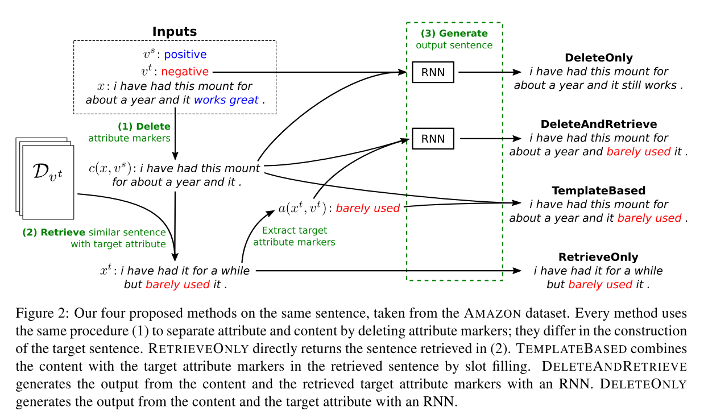
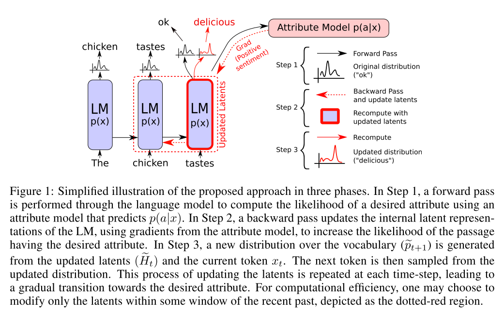
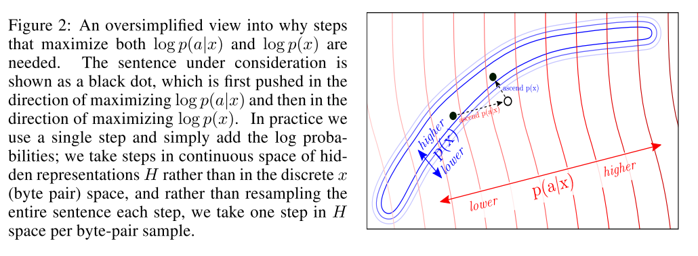
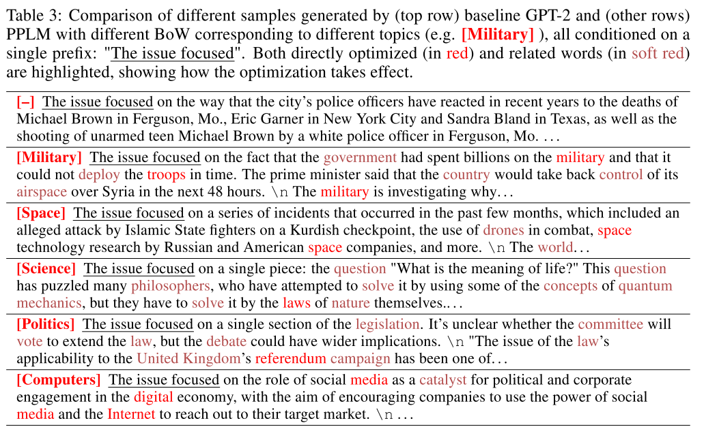

关于文本生成的话题聊得比较少，印象中我们之前只有一期多轮问句改写涉及到了文本生成，受控文本生成就更少了。

受控文本生成是在保证内容的前提下对文本的特性，例如情绪、文风等，进行控制。典型的任务有文本风格迁移。图片和声音的风格迁移都已经商用落地了，例如之前很火的几个应用例如Prisma和FaceApp，相比起来文本风格迁移的发展要慢一些。

文本风格迁移很像翻译任务（语言也可以认为是文本特性的一种），但相比于机器翻译，风格迁移任务几乎没有平行语料，所以要困难一些。如果你对这个方向有兴趣，强烈推荐北大付振新同学整理的这个[Repo](https://github.com/fuzhenxin/Style-Transfer-in-Text "A Paper List for Style Transfer in Text")。

受控文本生成因为是文本生成的高级版，通过学习相关技术可以很好地加深对文本生成的理解。受控文本生成从技法上来讲主要有两类，第一类在隐空间做文章，第二类在生成器的输出空间上做文章。

相比于在隐空间施加控制，我感觉在输出空间施加控制在方法上更简单一些。今天先从这个流派开始。我认为在输出空间进行控制又可以细分出两种形式，一种是在概率空间，一种是在离散空间，下面分别用一篇文章来举例。

#### Delete, Retrieve, Generate: A Simple Approach to Sentiment and Style Transfer
来自斯坦福NLP组，发表在2018年的NAACL，目前引用150，可以说是这个方向的经典论文了。

这篇其实包含了四种方法，但我感觉最有代表性的是在token空间进行的方法（即后面的template based方法），可解释性强，效率也高。

这篇文章的思路很简单，因为它基于一个假设：**通常文本特征迁移可以通过改变一些标志词或短语（attribute markers）来完成。** 在做风格迁移时，首先要找到这些attribute markers。找的方法也很简单，就是考虑某个n-gram在不同风格语料中出现的概率。如果有显著(salience, s)差异，那它就很可能是个attribute marker，显著性的计算公式如下，$u$是某个term，$v$是某种风格，$\mathcal{D}_v$是某种风格的所有语料，$\lambda$是个平滑系数。公式简单，大家一看便懂，计算出数值后根据阈值最终确定所有的attribute marker。

$$
s(u,v)=\frac{\text{count}(u, \mathcal{D}_v)+\lambda}{(\sum_{v'\in \mathcal{V},v'\neq v}\text{count}(u, \mathcal{D}_{v'}))+\lambda}
$$

围绕这些attribute marker（后文简称AM），后续将进行如文字标题所写的三种核心操作：`delete`, `retrieve`和`generate`。

##### Delete

Delete的目的是要删除句子中的AM，留下内容。用$a(x, v^{\text{src}})$表示源句子x中所有的AM，删除AM后的x表示为$c(x, v^{\text{src}})$，即不含AM的句子内容。

##### Retrieve
这一步是要在源句子中插入目标特性的AM。论文的策略是先使用$c(x, v^{\text{src}})$在目标特性句子集合中检索一个内容最接近的句子$x^{\text{tgt}}$。内容接近程度的评价可以使用任意的距离函数来完成。

##### Generate
这是最后一步，即获得最终的结果。文章里有四种策略

- **Retrieve Only** 直接返回第二步的结果。这么做生成的句子在语言角度应该是正确的且带有目标特性，但可能在内容上和源句有出入。
- **Template Based** 直接把$a(x, v^{\text{src}})$替换成$a(x^{\text{tgt}}, v^{\text{tgt}})$。这么做简单粗暴，可能产生不通顺的句子。
- **Delete Only** 把$c(x, v^{\text{src}})$交给一个RNN进行编码，再拼上特性$v^{\text{tgt}}$的embedding，最后交由一个解码器解码。
- **Delete And Retrieve** 和上一种相似，但不是拼上特性$v^{\text{tgt}}$的嵌入，而是用另一个RNN编码得到的$a(x^{\text{tgt}}, v^{\text{tgt}})$的表示向量。

前两种方法是不需要训练的，后两种则需要训练。对于**Delete Only**，使用**重建句子**任务（即训练一个自编码器）来训练。对于**Delete And Retrieve**则复杂一些，为了防止特征迁移的能力退化成句子拼接（c+a）的能力，作者在这里训练一个降噪自编码器，具体地说就是随机替换a里的AM。

论文针对做测试的三个数据集给出了一些生成结果的例子，我感觉效果还是可以的，毕竟还是RNN，也没有预训练啥的。

#### Plug and Play Language Models: A Simple Approach to Controlled Text Generation
来自Uber在ICLR 2020上发表的文章，文章很新，但已经有13次引用。

跟上一篇文章不同，这篇文章利用一个Attribute Model在概率空间对输出进行操作。

标准的语言模型在生成句子时是在每个时间步交替进行下面两步：

- 生成输出向量和历史隐向量：$o_{t+1},H_{t+1}=\text{LM}(x_t, H_t)$
- 将输出向量映射成词库概率分布并采样：$x_{t+1}\sim p_{t+1}=\text{Softmax}(Wo_{t+1})$

总体来看，PPLM的方案相比于上一篇文章更简洁一些，简而言之就是在生成器的每个时间步，将历史隐向量往更接近目标风格的方向拉，从而使得新生成的token更符合目标的风格。

和很多基于梯度的操作一样（例如对抗攻击），这个“拉”的操作是迭代完成的。指引方向的是attribute model，它可以根据输入判断句子含有某种attribute的概率，即$p(a|x)$。在每一次迭代，都将待修改的隐变量往$p$增大的方向拉。用公式写出来就是

$$
\Delta H_t \leftarrow \Delta H_t+\alpha \frac{\triangledown_{H_t }\text{log} p(a|H_t+\Delta H_t)}{\left \| \triangledown_{H_t }\text{log} p(a|H_t+\Delta H_t) \right \|^\gamma}
$$

使用上面的方法修改$H_t$可以提升$p(a|x)$，但可能会影响生成语言的通顺性。论文采用了两种方法来补救：

- 第一种是最小化修改前后$H_t$的KL散度，实际上市在上面的公式上增加了一项，如下图所示；
- 第二种是融合修改前后的输出概率（post-norm fusion)，即$x_{t+1}\sim \frac{1}{\beta}(\tilde{p}_{t+1}^{\gamma_{gm}}p_{t+1}^{1-\gamma_{gm}})$。其中$p_{t+1}$和$\tilde{p}_{t+1}$是修改前后的$H_t$产生的词库概率分布。

文中还提到特性模型除了可以用来更新隐空间向量$H_t$外还可以直接用来指导在文字空间的采样，以获得更好的生成样本。文章里还介绍了如何克服重复生成的问题，与主题关系较小，就不展开了。

介绍完整体框架现在介绍一下特别重要的特性模型（attribute model）。文中提到了两种。第一种是简单的词袋（BOW）模型，对于给定的关键词$\{w_1,...,w_k\}$，$p(a|x)$计算公式如下：

$$
\log p(a|x) =\log (\sum_i^k p_{t+1}[w_i])
$$

第二种就是直接训练一个判别模型了，其实做法很多，在此也不展开。最后来看一下PPLM的生成结果。

这篇论文的思路应该是很实用的，正文14页，附录有20页，很多细节都写在附录里，有兴趣的话可以读一读。

下一期将会介绍更复杂的在隐空间进行控制的方法，下期见👋